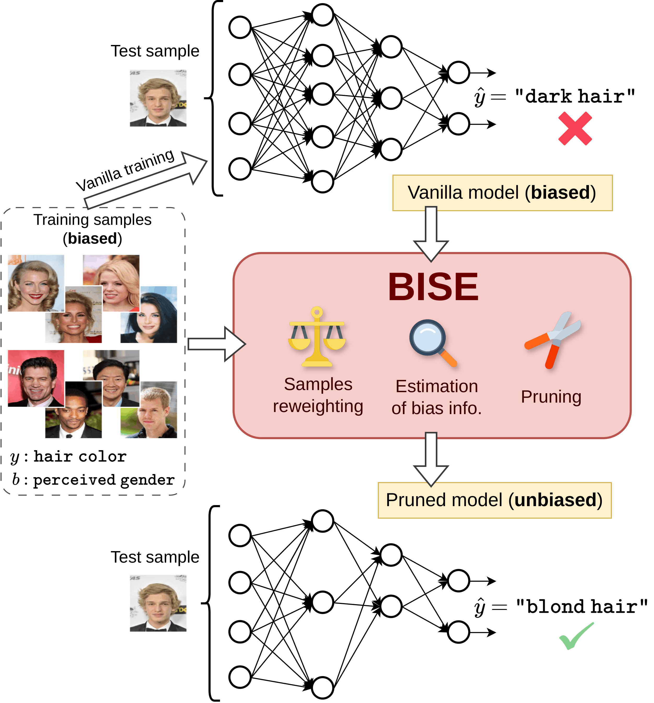

# Bias In, Bias Out? Finding Unbiased Subnetworks in Vanilla Models

Official code for the paper: "***Bias In, Bias Out? Finding Unbiased Subnetworks in Vanilla Models***", accepted at **CVPR 2026**.

**Authors:** Ivan Luiz De Moura Matos, Abdel Djalil Sad Saoud, Ekaterina Iakovleva, Vito Paolo Pastore, Enzo Tartaglione.

* [**Paper**](https://arxiv.org/abs/2603.05582)
* [**Page on the CVPR 2026 website**](https://cvpr.thecvf.com/virtual/2026/poster/38872)


<p align="middle">
  
</p>

## Requirements


To perform the experiments, we have used **miniconda**. We provide two files, to set up conda environments: ``environment.yml`` and ``environment_civil.yml``. 
- Please use ``environment.yml`` for experiments on all datasets, except CivilComments. 
- For CivilComments, use ``environment_civil.yml``. 

Please refer to: https://docs.conda.io/projects/conda/en/latest/user-guide/tasks/manage-environments.html#creating-an-environment-from-an-environment-yml-file.


## Downloading the datasets

The datasets should be stored in a folder ``data/``.

**For BiasedMNIST:** the data is automatically downloaded when the experiment is launched. A folder ``MNIST/`` is created inside ``data/``.

For CelebA, Corrupted-CIFAR10, and Multi-Color MNIST, we suggest: manually download the corresponding compressed folder into ``data/``, and then extract it, as follows.

**For CelebA:** First, download the file  ``celeba.tar.gz`` from https://drive.google.com/uc?id=1ebDzE4vsjPB4klNyTywjrZqGhUsFxZqb and place it inside ``data/``. In the sequence, extract it (for example, with the command ``tar xvzf celeba.tar.gz``). This creates the folder ``CelebA/`` inside ``data/``.

**For Corrupted-CIFAR10:** First, download the file ``cifar10c.tar.gz`` from https://drive.google.com/file/d/1_eSQ33m2-okaMWfubO7b8hhvLMlYNJP-/view and place it inside ``data/``. In the sequence, extract it (for example, with the command ``tar xvzf cifar10c.tar.gz``). This creates the folder ``cifar10c/`` inside ``data/``.

**For Multi-Color MNIST (following https://github.com/zhihengli-UR/DebiAN/tree/main):** First, download the file ``multi_color_mnist.tar.gz`` from https://github.com/zhihengli-UR/DebiAN/releases/download/v1.0/multi_color_mnist.tar.gz and place it inside ``data/``. In the sequence, extract it (for example, with the command ``tar xvzf multi_color_mnist.tar.gz``). This creates the folder ``multi_color_mnist/`` inside ``data/``.

**For CivilComments:** the dataset should be downloaded following https://github.com/izmailovpavel/spurious_feature_learning/tree/main (file ``all_data_with_identities.csv`` should be placed inside ``data/civilcomments_v1.0``). In our repository, the folder ``data_civilcomments`` contains the required code files (adapted from https://github.com/izmailovpavel/spurious_feature_learning/tree/main) for the experiments on this dataset.

## Launching the code

To run BISE with the default parameters (*i.e.*, with the settings reported in the main paper, for **BiasedMNIST with rho=0.99**), launch:

```
python bise.py
```

For experiments on CelebA, Corrupted-CIFAR10, Multi-Color MNIST and CivilComments, the parameter ``--dataset`` should be set to ``CelebA``, ``Cifar10C``, ``MulticolorMNIST`` and ``CivilComments``, respectively.

See all possible parameters in the main function of script ``bise.py``.


In summary, when the script ``bise.py`` is launched, the following steps are executed:
1. If a vanilla model does not exist (in the folder ``checkpoints/``), it is instantiated and trained with the default parameters specified in the paper (see the Supplementary Material). If the model is already stored, then it is directly loaded.
2. If the auxiliary classifier does not exist (in the folder ``checkpoints/``), it is instantiated and trained with the default parameters specified in the text. If the auxiliary classifier is already stored, then it is directly loaded.
3. The training of the masking parameters $\{m_i\}$ starts, and a dictionary is created inside ``dicts/`` (in a subfolder specific to the chosen dataset). After each epoch, the masked/pruned model is evaluated. This dictionary stores lists containing relevant metrics (accuracies, loss values), the sparsity of the model at each epoch, as well as the trained masks.


**NOTE:** To train the vanilla model for CivilComments, one should use the code from https://github.com/izmailovpavel/spurious_feature_learning/tree/main. The checkpoints should then be placed inside ``checkpoints/civilcomments/erm_seedX`` (where ``X`` should be replaced by the seed used).


# Citation

```bibtex
@InProceedings{De_Moura_Matos_2026_CVPR,
    author    = {De Moura Matos, Ivan Luiz and Saoud, Abdel Djalil Sad and Iakovleva, Ekaterina and Pastore, Vito Paolo and Tartaglione, Enzo},
    title     = {Bias In, Bias Out? Finding Unbiased Subnetworks in Vanilla Models},
    booktitle = {Proceedings of the IEEE/CVF Conference on Computer Vision and Pattern Recognition (CVPR)},
    month     = {June},
    year      = {2026},
    pages     = {3294-3305}
}
```

